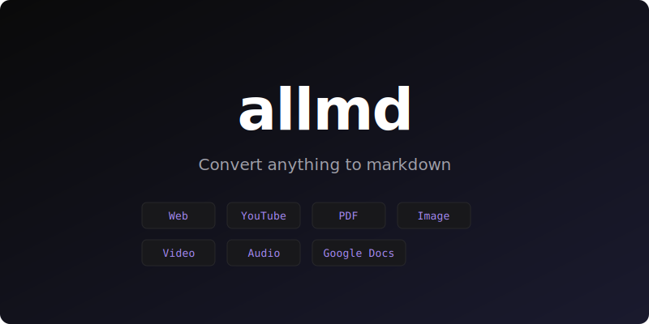

<p align="center">
  <a href="https://github.com/mblode/allmd">
    
  </a>
</p>

<p align="center">
  <a href="https://www.npmjs.com/package/allmd"></a>
  <a href="https://www.npmjs.com/package/allmd"></a>
  <a href="LICENSE.md"></a>
  <a href="https://github.com/mblode/allmd">= 20"></a>
</p>

- **Web pages:** fetch any URL and convert to clean markdown with Readability.
- **YouTube videos:** extract transcripts with timestamps.
- **PDFs:** parse text content from PDF files.
- **Google Docs:** convert published Google Docs to markdown.
- **Video/audio:** transcribe media files using Whisper.
- **Images:** describe images using GPT vision.
- **AI formatting:** all output is polished with GPT for consistent, readable markdown.
- **Interactive mode:** run `allmd` with no arguments to pick a converter.

## Installation

```bash
npm install -g allmd
```

Set your OpenAI API key:

```bash
export OPENAI_API_KEY=your-key
```

Requires Node.js 20+ and `ffmpeg` for video/audio (bundled via `ffmpeg-static`).

## Usage

Run `allmd` with no arguments for interactive mode.

```bash
allmd web https://example.com -o article.md
allmd youtube https://youtube.com/watch?v=dQw4w9WgXcQ -o transcript.md
allmd pdf document.pdf -o document.md
allmd gdoc https://docs.google.com/document/d/... -o doc.md
allmd video recording.mp4 -o transcript.md
allmd image screenshot.png -o description.md
```

## Options

```
-o, --output <file>   Write to a file instead of auto-generating
-V, --version         Show version
-h, --help            Show help
```

## API

```typescript
import { convertWeb, convertPdf, convertYoutube } from "allmd";

const result = await convertWeb("https://example.com", { ai: true });
console.log(result.markdown);
```

Available converters: `convertWeb`, `convertYoutube`, `convertPdf`, `convertGdoc`, `convertVideo`, `convertImage`.

## AI Agents

Add allmd as a skill for Claude Code, Cursor, Codex, and other AI coding assistants:

```bash
npx skills add mblode/allmd
```

## License

[MIT](LICENSE.md)
